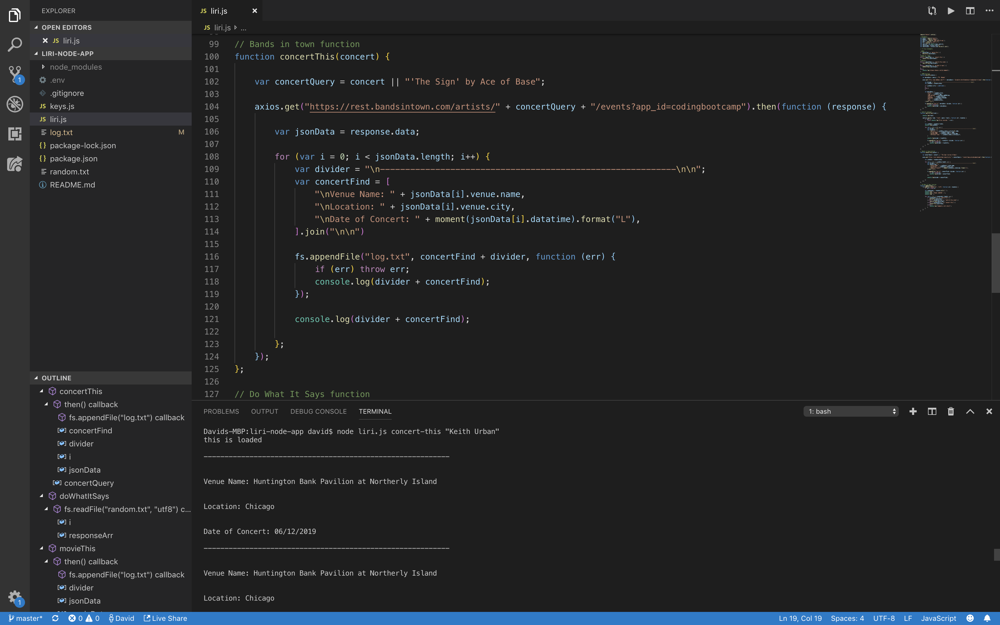
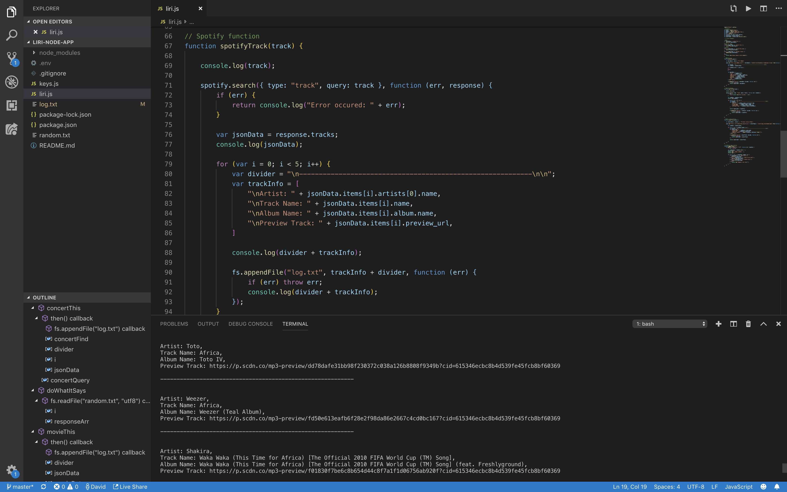
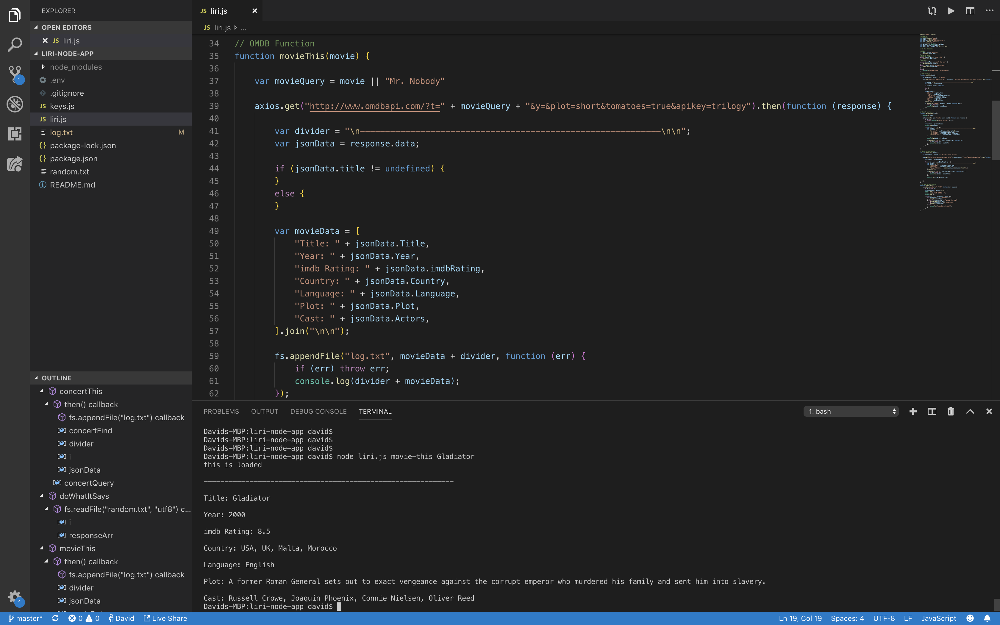

Liri Node Application

Technologies Used

Node.js
Javascript
Spotify API
OMDB API
Bands in Town API

Logic
Create an application with Node.js that implements the user's input from a command line.
The application will include information retracted from API's to fufill the user's request in the commands line.
The API calls will parse through JSON objects, and exporting the information in a self created format.

Using the Bands in Town API to call information on current concerts using command line input "node liri.js concert-this Keith Urban"

Using the Spotify API to call information on songs using command line input "node liri.js spotify-this Africa"

Using the OMDB API to call information on movies using command line input "node liri.js movie Gladiator"

